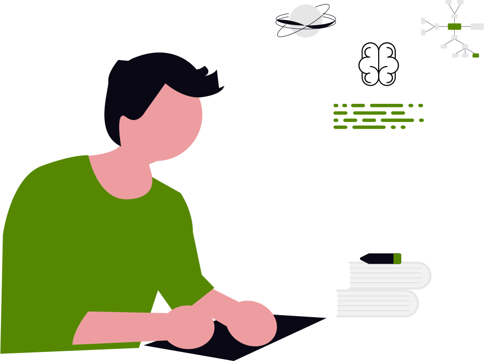

<h1 align="center">AI Learning Kit</h1>

A curated collection of AI learning materials

  
   

 

<strong>💡 How to use this guide</strong>

 
Follow the sections sequentially. Explore the resources in each section to find what fits you best. Depending on your background, a single resource may be enough, or you might need to combine a few depending on your goals.

**Resource Types:**

> 📍 Roadmap &nbsp; 📗 Free &nbsp; 📘 Paid &nbsp; 🎥 Video Course &nbsp; 📁 Repository &nbsp; 🚉 Practice Platform

---

## 🗺️ Roadmaps

- 📍&nbsp;&nbsp;[AI Engineer Roadmap](https://roadmap.sh/ai-engineer) — Step-by-step guide to building modern AI applications and working with LLMs
- 📍&nbsp;&nbsp;[ML Engineer Roadmap](https://roadmap.sh/machine-learning) — Structured path covering core ML algorithms, model training, & MLOps
- 📍&nbsp;&nbsp;[Data Engineer Roadmap](https://roadmap.sh/data-engineer) — Complete guide to data pipelines, databases, & preparing data for AI workflows

 

## 🚀 Introduction to AI

- 🎥&nbsp;&nbsp;[AI For Everyone](https://learn.deeplearning.ai/courses/ai-for-everyone/information) — Andrew Ng's non-technical intro to AI concepts and strategy
- 📗&nbsp;&nbsp;[Elements of AI](https://www.elementsofai.com/) — Introduction to AI basics by the University of Helsinki
- 🎥&nbsp;&nbsp;[Understanding Artificial Intelligence](https://app.datacamp.com/learn/courses/understanding-artificial-intelligence) — DataCamp course covering AI fundamentals

 

## 🧮 Maths for AI

- 🎥&nbsp;&nbsp;[The Math Behind AI](https://www.deeplearning.ai/courses/mathematics-for-machine-learning-and-data-science-specialization/) — DeepLearning.AI specialization on math essentials
- 🎥&nbsp;&nbsp;[Khan Academy](https://www.khanacademy.org/) — Foundational math courses covering all AI prerequisites
  - [Linear Algebra](https://www.khanacademy.org/math/linear-algebra)
  - [Calculus](https://www.khanacademy.org/math/calculus-home)
  - [Statistics and Probability](https://www.khanacademy.org/math/statistics-probability)
- 📗&nbsp;&nbsp;[Mathematics for Machine Learning](https://mml-book.github.io/) — Free textbook by Deisenroth, Faisal, and Ong

 

## 🐍 Python for AI

- 🎥&nbsp;&nbsp;[Python for Everybody](https://www.coursera.org/specializations/python) — Dr. Chuck's beginner Python specialization on Coursera
- 🎥&nbsp;&nbsp;[AI Python for Beginners](https://www.deeplearning.ai/short-courses/ai-python-for-beginners/) — DeepLearning.AI short course on Python for AI workflows

 

## 📚 Python Libraries for AI

- 🎥&nbsp;&nbsp;[The Numpy Stack in Python](https://www.udemy.com/course/deep-learning-prerequisites-the-numpy-stack-in-python/) — Lazy Programmer's course on numpy, pandas & matplotlib
- 🎥&nbsp;&nbsp;[Introduction to Data Science in Python](https://www.coursera.org/learn/python-data-analysis) — University of Michigan course on Coursera
- 📗&nbsp;&nbsp;[Data Analysis with Python](https://www.freecodecamp.org/learn/data-analysis-with-python/) — freeCodeCamp certification with projects

 

## 💻 AI Foundations

- 🎥&nbsp;&nbsp;[CS50's Intro to AI with Python](https://www.youtube.com/watch?v=gR8QvFmNuLE&list=PLhQjrBD2T381PopUTYtMSstgk-hsTGkVm) — Harvard's AI course covering search, knowledge, and learning
- 🎥&nbsp;&nbsp;[Udacity AI Nanodegree](https://www.udacity.com/course/ai-artificial-intelligence-nanodegree--nd898) — Project-based AI program with mentorship
- 📘&nbsp;&nbsp;[AI Engineering](https://www.oreilly.com/library/view/ai-engineering/9781098166298/) — Chip Huyen's guide to building AI applications in production
- 📁&nbsp;&nbsp;[AI For Beginners](https://github.com/microsoft/AI-For-Beginners) — Microsoft's 12-week, 24-lesson AI curriculum

 

## 🤖 Machine Learning

- 🎥&nbsp;&nbsp;[Machine Learning Specialization](https://www.deeplearning.ai/courses/machine-learning-specialization/) — Andrew Ng's foundational 3-course series on Coursera
- 🎥&nbsp;&nbsp;[Google's Machine Learning Crash Course](https://developers.google.com/machine-learning/crash-course) — Fast-paced intro with TensorFlow exercises
- 📘&nbsp;&nbsp;[Hands-On Machine Learning with Scikit-Learn and PyTorch](https://www.oreilly.com/library/view/hands-on-machine-learning/9798341607972/) — Aurélien Géron's practical ML guide
- 📘&nbsp;&nbsp;[The 100-Page ML Book](https://themlbook.com/) — Andriy Burkov's concise ML reference
- 📗&nbsp;&nbsp;[Python Data Science Handbook](https://jakevdp.github.io/PythonDataScienceHandbook/) — Jake VanderPlas's free guide to the Python data science stack

 

## 🧠 Deep Learning

- 🎥&nbsp;&nbsp;[Deep Learning Specialization](https://www.deeplearning.ai/courses/deep-learning-specialization/) — Andrew Ng's 5-course deep learning series
- 📗&nbsp;&nbsp;[Practical Deep Learning](https://course.fast.ai/) — fast.ai's top-down, code-first approach to deep learning
- 🎥&nbsp;&nbsp;[Neural Networks: Zero to Hero](https://www.youtube.com/playlist?list=PLAqhIrjkxbuWI23v9cThsA9GvCAUhRvKZ) — Andrej Karpathy's series explaining math & code behind neural networks
- 🎥&nbsp;&nbsp;[MIT 6.S191: Introduction to Deep Learning](http://introtodeeplearning.com/) — MIT's flagship intro to deep learning
- 📗&nbsp;&nbsp;[Deep Learning Book](https://www.deeplearningbook.org/) — The "bible of deep learning" by Ian Goodfellow, Yoshua Bengio, and Aaron Courville
- 📗&nbsp;&nbsp;[Dive into Deep Learning](https://d2l.ai/) — Interactive textbook with code in PyTorch, TensorFlow, and JAX

 

## 🔗 LLMs (Large Language Models)

- 🎥&nbsp;&nbsp;[Intro to Large Language Models](https://www.youtube.com/watch?v=zjkBMFhNj_g) — Andrej Karpathy's 1-hour LLM overview
- 📗&nbsp;&nbsp;[Hugging Face LLM Course](https://huggingface.co/learn/llm-course) — End-to-end course on building with LLMs

 

## ✨ Generative AI

- 🎥&nbsp;&nbsp;[Generative AI for Everyone](https://www.deeplearning.ai/courses/generative-ai-for-everyone/) — Andrew Ng's non-technical intro to generative AI
- 🎥&nbsp;&nbsp;[Google AI Essentials](https://www.coursera.org/google-certificates/ai-essentials-google) — Beginner-friendly professional certificate on using gen AI tools
- 🎥&nbsp;&nbsp;[Generative AI with LLMs](https://www.deeplearning.ai/courses/generative-ai-with-llms/) — DeepLearning.AI + AWS course on training and deploying LLMs
- 🎥&nbsp;&nbsp;[Google's Intro to Generative AI](https://www.cloudskillsboost.google/paths/118) — Google Cloud Skills Boost learning path

 

## ✍️ Prompt Engineering

- 🎥&nbsp;&nbsp;[ChatGPT Prompt Engineering for Developers](https://www.deeplearning.ai/short-courses/chatgpt-prompt-engineering-for-developers/) — DeepLearning.AI course with Isa Fulford and Andrew Ng
- 📗&nbsp;&nbsp;[Prompt Engineering Guide](https://www.promptingguide.ai/) — DAIR.AI's comprehensive and community-driven guide
- 📗&nbsp;&nbsp;[OpenAI Prompt Engineering Docs](https://platform.openai.com/docs/guides/prompt-engineering) — Official best practices from OpenAI

 

## 🛠️ Frameworks

- 🎥&nbsp;&nbsp;[PyTorch for Deep Learning](https://www.coursera.org/professional-certificates/pytorch-for-deep-learning) — Professional PyTorch Certificate by Coursera
- 🎥&nbsp;&nbsp;[TensorFlow in Practice](https://www.coursera.org/professional-certificates/tensorflow-in-practice) — Professional TensorFlow Certificate by Coursera
- 📗&nbsp;&nbsp;[Hugging Face Transformers](https://huggingface.co/docs/transformers/) — Industry-standard library for state-of-the-art NLP models
- 🎥&nbsp;&nbsp;[LangChain for LLM App Development](https://www.deeplearning.ai/short-courses/langchain-for-llm-application-development/) — DeepLearning.AI short course on LangChain fundamentals

 

## 🗄️ RAG

- 🎥&nbsp;&nbsp;[Retrieval Augmented Generation](https://www.deeplearning.ai/courses/retrieval-augmented-generation-rag/) — Build RAG systems with LLMs

 

## 🏆 Challenges & Interactive Practice

- 🚉&nbsp;&nbsp;[Kaggle Competitions](https://www.kaggle.com/competitions) — Real-world ML competitions with datasets and leaderboards
- 🚉&nbsp;&nbsp;[LeetCode Pandas Challenges](https://leetcode.com/problemset/pandas/) — Practice data manipulation with Pandas problems
- 🚉&nbsp;&nbsp;[StrataScratch](https://www.stratascratch.com/) — Data science interview questions from top companies
- 🚉&nbsp;&nbsp;[Deep-ML](https://www.deep-ml.com/) — Hands-on ML coding challenges with real datasets
- 🚉&nbsp;&nbsp;[TensorTonic](https://www.tensortonic.com/) — Implement 200+ ML papers and algorithms from scratch
- 🚉&nbsp;&nbsp;[DataInterview](https://www.datainterview.com/) — Practice SQL and Python for data science interviews
- 📁&nbsp;&nbsp;[100 NumPy Exercises](https://github.com/rougier/numpy-100) — Progressive NumPy challenges with solutions

 

---

### Contributing

Contributions are always welcome! Whether it's adding new quality resources or suggesting a new category, join us in making this the ultimate AI guide. [Read the guidelines](./CONTRIBUTING.md)

### License

This repository is MIT-licensed. [Read more](./LICENSE)
